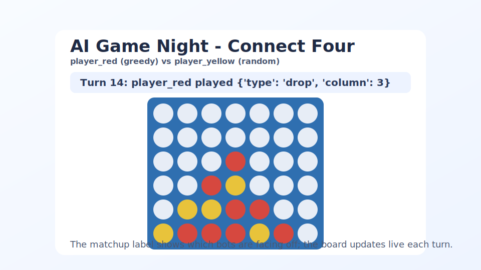

# Connect Four: The Strategy Step-Up

Connect Four is the natural next step after Tic-Tac-Toe.
The rules are still explainable in under a minute, but the larger board and gravity-driven
drops reward real lookahead — bot quality differences show up fast and clearly.



## Why This Is Great For Game Night

- Rules are simple, but the 7x6 board has real tactical and positional depth.
- Gravity (discs always fall to the lowest open cell) makes "what happens next" easy for a group to reason about together.
- Games run longer than Tic-Tac-Toe but still finish quickly, so iteration stays fast.
- Search and threat-detection bots clearly outperform random/positional ones — a satisfying first target for a smarter bot.

## The Game In One Minute

- Two players alternate dropping discs into one of 7 columns.
- `player_red` drops `R` and always moves first.
- `player_yellow` drops `Y` and moves second.
- Each disc falls to the lowest empty cell in the chosen column (gravity).
- First player to connect 4 of their discs in a row — horizontally, vertically, or diagonally — wins.
- If the board fills with no 4-in-a-row, the game is a draw.

## What Data Your Bot Gets

Your bot receives an `observation` and a `context` object on every turn.

### Observation

- `public_state.board`: current 42-cell board values (`"R"`, `"Y"`, or `" "`), indexed `row * 7 + col` with row `0` at the top and row `5` at the bottom
- `public_state.current_player`: whose turn it is (`player_red` or `player_yellow`)
- `public_state.turn_index`: turn number
- `public_state.done`: whether the game is over
- `public_state.winner`: winner id or `null`
- `private_state.marker`: your marker (`R` or `Y`)
- `context.opponent_id`: opponent player id
- `context.columns`: `7`
- `context.rows`: `6`
- `context.win_length`: `4`
- `legal_actions`: all currently droppable columns (full columns are excluded)

### Action Format

Every move is:

```json
{"type": "drop", "column": 3}
```

Where `column` is an open column from `0` to `6`. The disc lands on top of whatever is
already stacked in that column — you don't choose the row.

## Information Policy

This is a perfect-information game.
There is no hidden state in Connect Four, so bots get everything a real player would see.

## Run It Live

Headless quick match:

```bash
uv run gamenight run-game --game connect_four --mode headless --bot-1 greedy --bot-2 random
```

GUI match:

```bash
uv run gamenight run-game --game connect_four --mode gui --bot-1 player:mark --bot-2 random --gui-delay 0.4 --replay-file artifacts/mark_vs_random_gui.json
```

Large series with randomized first-player order:

```bash
uv run gamenight run-series --game connect_four --bot-a player:mark --bot-b random --games 1000 --starting-policy random --order-seed 20260607 --order-key season-1 --summary-file artifacts/mark_vs_random_series.json
```

## Learn More

- Bot contract: see `BOT_SPEC.md`
- Example inputs/outputs: see `EXAMPLES.md`
- Baseline bots: see `bots/baselines/`
