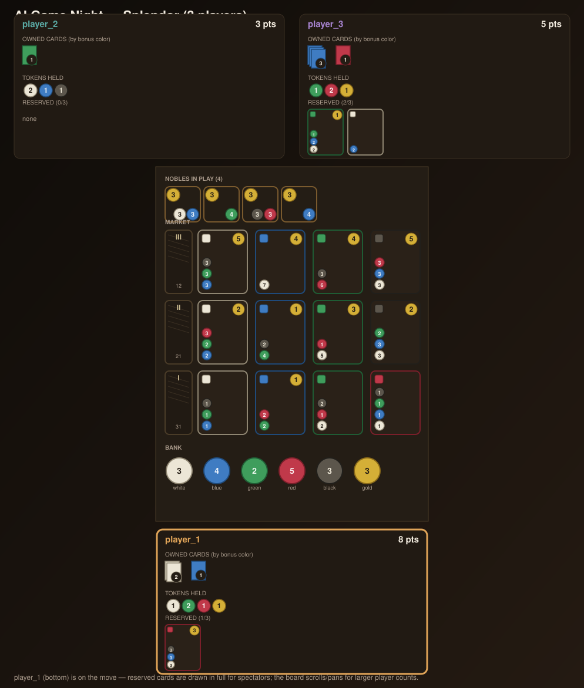

# Splendor: A Shared Market, No Hidden Board

Splendor is a resource-engine-building game: 2-4 merchants collect gem tokens, use them
to buy development cards that grant permanent discounts (and sometimes points), and race
to 15 points by building an engine that makes later cards cheaper than earlier ones. It's
the first game in this framework with **no card-effect rules engine at all** -- every
card is static data (a cost, a bonus color, a point value), it's **almost perfect
information** (everything except which cards a player has reserved is visible to
everyone at all times), and it's the first game here that isn't fixed at exactly two
players.



## Research (per `docs/how_to_add_game.md`)

**Is Splendor "solved"?** No -- and there's no full game-tree work for it the way there
is for Connect Four (forced first-player win, Allis 1988) or Checkers (forced draw,
Schaeffer/Chinook 2007). What does exist is analysis of a strong *exploit* strategy:
skipping cheap tier-1 cards entirely and monopolizing a single gem color to starve
opponents of it (see ["The Splendor
Solution"](https://atomicgametheory.com/the-splendor-solution/)) -- the author calls it
effective but not fun, and explicitly stops short of claiming a full solve. That makes
Splendor a genuine open contest, similar to Battleship's status in this repo: no fixed,
known perfect-vs-perfect ceiling, so bot-vs-bot matches stay interesting over time.

**Existing open-source implementations.** A search turned up a real cluster of
Splendor-adjacent GitHub projects -- more, and somewhat more developed, than Battleship's
search did:

- [`pyminion`](https://github.com/evanofslack/pyminion)-style rules engines exist for
  this game too (e.g. [`eitanf/grandeur`](https://github.com/eitanf/grandeur), a C++
  "clone of Splendor for evaluating AIs"), but nothing speaks this repo's
  `GameProtocol` / `StepResult` / replay / `GameViewerProtocol` contracts.
- A cluster of reinforcement-learning projects
  ([`roeey777/Splendor-AI`](https://github.com/roeey777/Splendor-AI),
  [`BreckEmert/Splendor-AI`](https://github.com/BreckEmert/Splendor-AI),
  [`seal256/splendor`](https://github.com/seal256/splendor), and an AlphaZero-style
  MCTS bot, [`inhabae/AhinLendor`](https://github.com/inhabae/AhinLendor), formerly
  named "Splendor-Zero," which reached rank 1 on a community leaderboard) confirm this
  is a well-studied bot-training target, but none ship a GUI.
- [`caeleel/splendor`](https://github.com/caeleel/splendor) (56 stars, unlicensed) and
  [`hexanome-04/splendor`](https://github.com/hexanome-04/splendor) (MIT, Java) are the
  two with an actual playable client -- worth a look for layout ideas, but coupled to
  their own server/client protocols and (for `caeleel/splendor`) not under a license
  that permits reuse.
- The official digital Splendor (published by Space Cowboys / Asmodee) is closed
  source, same as Dominion's official client -- not adaptable, just a UX benchmark.

**Decision: build the game and viewer from scratch**, the same call Battleship's and
Connect Four's research reached, but for a different reason here -- Splendor genuinely
needs less bespoke engineering than either of them. There's no hidden-fleet redaction
logic to get right (Battleship) and no per-card effects/decision-stack machinery to
design (the reason Dominion was set aside in favor of this game -- see the project
history). It's the closest thing in this repo to Connect Four's complexity, just with
richer board state to draw.

## Why This Is Great For Game Night

- No per-card scripting: every card is `{cost, bonus, points}`, so the entire ruleset
  is small enough to read in one sitting, but the *decisions* (which colors to hoard,
  when to reserve instead of buy, when to sacrifice tempo for a noble) have real depth.
- Nearly everything is public -- bank, market, every player's points/bonuses/tokens --
  so a spectator (or a new player) can watch and understand exactly why a bot did what
  it did, turn by turn, with almost no hidden-state guesswork.
- The "engine-building" arc (early buys are slow and expensive, late buys are
  practically free thanks to bonuses) gives a satisfying shape to a full game, and
  rewards bots that plan a few purchases ahead rather than greedily grabbing whatever's
  cheapest this turn.
- No solved ceiling (see Research above) -- bot-vs-bot matchups stay an open contest.

## Player Count (2-4)

Splendor supports 2-4 players, matching the real game exactly: the bank (4/5/7 tokens
per color, gold always 5) and the number of revealed nobles (3/4/5, always `players +
1`) both scale with player count. `SplendorGame.__init__(num_players=2)` builds
`player_ids = ["player_1", ..., "player_N"]` sized to match, and `MIN_PLAYERS`/
`MAX_PLAYERS` class attributes (2/4) tell the CLI what's legal.

This is also the first game in this repo not fixed at exactly two players, which
required a small, additive core infrastructure change rather than anything
Splendor-specific: `GameRegistry` now stores a *factory* per `game_id` (usually just the
game class itself, called with no arguments) instead of one fixed instance, so
`registry.get("splendor", num_players=3)` can hand back a freshly-sized instance for
that match. Fixed 2-player games (Tic-Tac-Toe, Connect Four, Battleship) are unaffected
-- `registry.get(game_id)` with no kwargs behaves exactly as before. `run-game` gained a
`--bots` option (comma-separated, seat order) alongside the existing `--bot-1`/
`--bot-2`, used whenever a game's player count isn't exactly 2 -- see "Run It Live"
below. `run-series`/`run-bracket`/`run-tournament` are unchanged and still exactly
2-competitor by design (a series or a bracket match is inherently head-to-head); N-player
support is for `run-game` only.

## Card Data

This implementation's 90 development cards and 10 nobles are **procedurally
generated**, not a transcription of the retail card list. The generator
(`game.py`'s `_build_tier`) follows Splendor's well-documented, genuinely public tier
structure -- a 40/30/20 split across tiers 1/2/3, an even 8/6/4-cards-per-bonus-color
split within each tier, and point/cost bands that rise by tier (tier 1: 0-1 points,
cheap; tier 3: 3-5 points, expensive) -- but the specific cost of any individual card
(e.g. exactly which colors and amounts `t2-14` costs) is this implementation's own data,
not the printed game's. This was a deliberate choice: the exact 90-card table isn't
something to assert from memory with confidence, and getting individual card numbers
wrong would be a worse outcome than being upfront that they're generated. The *rules*
engine (turn structure, action types, affordability math, win condition) is fully
faithful to the real game regardless.

## The Game In One Minute

- Each turn is one main action: take gem tokens, reserve a development card, or
  purchase one.
- 5 gem colors (white, blue, green, red, black) plus gold, a wildcard token you only
  ever get from reserving.
- The market is 3 tiers of development cards, 4 face-up per tier at all times (refilled
  immediately from that tier's deck whenever a card is taken) -- tier 3 is the most
  expensive and highest-scoring, tier 1 the cheapest.
- Owning a card grants a permanent bonus in its color, discounting every future
  purchase's cost in that color by 1 per matching card owned -- this is the "engine"
  that makes the back half of a game move faster than the front half.
- Ten nobles are worth 3 points each and visit automatically (no cost, no action spent)
  the instant your bonuses meet their requirement.
- First to 15+ points triggers the final round -- the match doesn't end on the spot,
  every player finishes out an equal number of turns first (everyone else gets exactly
  one more turn, however many players that is), then the higher score wins, tiebroken
  by fewer cards owned (a more efficient engine) among however many players are tied,
  and a genuine points-and-cards tie is reported as a draw.

## What Data Your Bot Gets

Your bot receives an `observation` and a `context` object on every step. Splendor has
**three phases** (`"action"`, `"discard"`, `"noble_choice"` -- see BOT_SPEC.md) but the
observation's top-level shape never changes, splitting into `public_state` (true for
everyone), `private_state` (yours specifically -- see Information Policy for why that's
not the same as "hidden"), and `context` (fixed facts about the match). Every field
below has a matching `TypedDict` in `types.py` -- see "Explicit Types" below.

- `public_state`: `phase`, `current_player`, `turn_index`, `done`/`winner`,
  `final_round_trigger`, `bank`, `nobles`, `market` (keyed by integer tier `1`/`2`/`3`),
  and `players` -- **every player's** (2 to 4, including you) points, bonuses, token
  counts, reserved-card *count*, claimed nobles, and (new) `visible_reserved_cards` --
  the subset of that player's reserved cards whose identity is public knowledge. All
  public.
- `private_state.your_reserved_cards`: your own reserved cards, always in full
  regardless of how you got them -- each one tagged `"source": "market"` or `"source":
  "deck"`. This lives under `private_state` because they're *yours*, not because
  they're secret from everyone else -- see Information Policy just below.
- `context`: `opponent_ids` (a list -- 1 to 3 entries, one per other seat), `colors`,
  `reserve_limit` (3), `token_limit` (10), `win_threshold` (15), and
  `pending_noble_choices` (only non-empty during `"noble_choice"`).
- `legal_actions`: every legal action for whichever phase you're currently in.

## Explicit Types

`types.py` defines a `TypedDict` for every shape above (`SplendorObservation`,
`SplendorAction` -- a `Literal`-tagged union of the 6 action shapes -- `CardView`,
`ReservedCardView`, `NobleView`, `PlayerPublicView`, `Context`, ...). These describe the
exact plain dict your `choose_action` already receives -- no conversion, no wrapper
object, zero runtime cost -- so annotating your method as `observation:
SplendorObservation` instead of the generic `Observation` gets real editor autocomplete
and type-checker coverage on every nested field, and lets a checker (or an LLM reading
the code) narrow `action["type"]` into which other fields are valid, the same way any
tagged union narrows. All four baseline bots and `example_player/bot.py` use this by
default now -- it replaced an earlier, optional dataclass-with-`.from_dict()` wrapper
that required an explicit conversion step; `TypedDict` needs none, since the dict
already *is* the shape.

## Information Policy

Splendor is **almost perfect information** -- a sharp contrast with Battleship's fully
hidden fleets -- but it's not *quite* "everything except your opponents' reserve
counts," and that nuance is worth being precise about rather than just calling
`private_state` "the hidden part": **a reserved card is only genuinely secret if it was
reserved blind.** A card reserved from the face-up market was watched leaving the
market by every player at the table the instant before it happened -- there's nothing
left to hide, so `observe()` shows it to everyone via
`public_state.players[<id>].visible_reserved_cards`. A card reserved blind off a deck,
by contrast, is never seen by anyone but the reserving player -- that's the actual (and
only) hidden-information surface of this game. `reserved_count -
len(visible_reserved_cards)` is exactly how many of an opponent's reserves are still
genuinely unknown to you. See BOT_SPEC.md's "Reserved-Card Visibility" section for the
full field-by-field reference, and EXAMPLES.md for a real worked example of both sides
of this split (`player_1`'s market reserve visible to `player_2`, blind reserve not).

**The spectator GUI is more generous still.** It draws every reserved card in full for
every player, blind-origin included (tagged `(blind)` so a spectator can tell which is
which) -- the one thing bots still never get. This is the same "TV broadcast" precedent
Battleship's GUI set (showing spectators something a competing bot doesn't), just with a
smaller gap to bridge here since bots already see the market-origin half themselves. The
GUI reads this straight off the engine's own internal state (which always has full card
data for every reservation) rather than off any bot's `observe()` output.

## GUI Layout

The board is seated like a real table rather than laid out as a flat list: seat 0
(`player_ids[0]`, i.e. whichever bot is `--bot-1` or first in `--bots`) always sits at
the bottom, closest to the viewer, and every other seat fans out around the remaining
edges -- top for 2 players, top-left/top-right for 3, and all four compass points
(bottom/left/top/right) for 4. The market, bank, and nobles sit in the center, shared by
everyone. Each player's mat shows their owned cards as small color-coded stacks (one
stack per bonus color, capped at 3 visible layers with a count badge -- a physical stack
tops out visually too, same as a real tableau) rather than a bare number, plus their
token counts and their reserved cards drawn in full (see Information Policy above).

A 4-player board has real size to it, so the canvas scrolls (drag the scrollbars, use
the mouse wheel/trackpad, or resize the window) inside a fixed-size window rather than
shrinking dense text to force a fit -- nothing gets clipped, you just pan to see the rest
of the table.

## Run It Live

Headless quick match (2 players):

```bash
uv run gamenight run-game --game splendor --mode headless --bot-1 greedy --bot-2 random --replay-file artifacts/splendor_greedy_vs_random.json
```

3 or 4 players -- use `--bots` (comma-separated, seat order) instead of
`--bot-1`/`--bot-2`:

```bash
uv run gamenight run-game --game splendor --mode headless --bots greedy,random,player:mark,greedy --replay-file artifacts/splendor_4p.json
```

GUI match:

```bash
uv run gamenight run-game --game splendor --mode gui --bots greedy,random,player:mark --gui-delay 0.4 --replay-file artifacts/splendor_gui.json
```

Replay a saved match:

```bash
uv run gamenight replay --replay-file artifacts/splendor_greedy_vs_random.json
```

Large series (`run-series` is 2-competitor only, regardless of player count -- see
"Player Count" above):

```bash
uv run gamenight run-series --game splendor --bot-a greedy --bot-b random --games 40 --summary-file artifacts/splendor_series.json
```

## Tournament Mode & Bracket Reveal

Full game-night event, same shape as Battleship's: `run-tournament` shuffles the
entrants, plays a round robin, seeds a single-elimination bracket from the standings,
then runs the bracket -- and `replay-bracket-gui` turns the saved result into a live
"reveal" window (bracket tree + a "Play Next Match" button that replays each match on an
embedded board, propagating winners round to round until a champion is crowned).

```bash
uv run gamenight run-tournament --game splendor \
  --bots greedy,random,player:mark,player:alice \
  --round-robin-games 1 --bracket-games 3 \
  --output-dir artifacts/splendor_tournament

uv run gamenight replay-bracket-gui --game splendor --bracket-dir artifacts/splendor_tournament
```

`games/splendor/bracket_gui.py` mirrors `battleship/bracket_gui.py`'s structure closely
(same tree/standings/controls layout, same saved-replay-only "no bots run" design) --
the one real adaptation is the embedded board itself: Battleship draws two boards
side by side (`player_blue`/`player_orange`), Splendor draws a single board using the
same `_seat_layout(2)` and `draw_board` the live 2-player GUI uses, with `bot_a` always
shown in the bottom seat and `bot_b` in the top seat regardless of which `player_1`/
`player_2` id each bot was actually assigned in a given game (starting player
alternates) -- done by reordering which id `draw_board` looks up per seat, not by
touching the replayed state.

### Why every match stays 2-player, even though Splendor itself supports 4

This is worth calling out explicitly rather than leaving implicit: **entrant count**
into the tournament is completely unconstrained -- 2 entrants is a valid tournament, so
is 16, and the bracket phase handles an odd count with a bye exactly like `run-bracket`
does standalone. That's "as few or as many players as you want" already, today, with no
changes needed.

What's *not* unconstrained, on purpose, is the size of each individual round-robin or
bracket **matchup** -- every one of them is still a 2-player Splendor game, even in a
tournament with 4-player-capable `SplendorGame` sitting right there. Two reasons this is
the right call rather than a limitation to fix:

1. **Standings math assumes pairwise wins/losses.** `core/bracket.py`'s round-robin and
   bracket standings are built entirely around "who won this match" between exactly two
   competitors -- win/loss records, seeding by win count, bracket pairing. A 4-player
   *group* match (all four players in one Splendor game, one shared winner) doesn't
   produce a win/loss pair the same way; it produces one winner and three others whose
   relative finish (2nd/3rd/4th, or by final points) isn't currently tracked *anywhere*
   in this repo's standings model. Bolting group matches onto the existing round-robin/
   bracket math would mean designing that scoring system too, not just calling
   `SplendorGame(num_players=4)` from a different call site.
2. **Fairness and reproducibility get harder, not easier.** A pairwise match isolates
   exactly two competitors' decisions from everyone else's; a 4-player group match means
   your placement depends on three other people's play, not just your opponent's -- a
   much noisier signal per match, and "seed the bracket by round-robin standings" starts
   to mean something different once a single match result is itself already a 4-way
   outcome.

If a genuine "battle royale" tournament format (heats of 3-4 players, top N advance,
placement-based scoring) is something you want later, that's a real, distinct feature
worth designing on its own terms -- not a small tweak to `_run_series`. The pairwise
round-robin + bracket you get today is the same proven structure Battleship already
uses, just pointed at a game that happens to also support bigger free-for-all matches
outside of tournament mode (`run-game --bots a,b,c,d`).

## Learn More

- Bot contract: see `BOT_SPEC.md`
- Example inputs/outputs: see `EXAMPLES.md`
- Engine verification: see `EDGE_CASES.md`
- Baseline bots: see `bots/baselines/`
