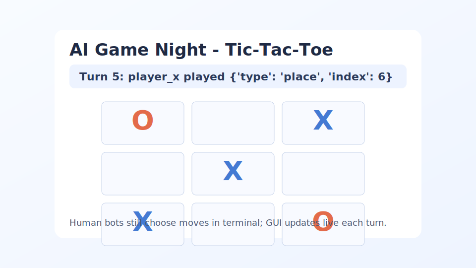

# Tic-Tac-Toe: The Perfect Bot Warmup

Tic-Tac-Toe is the fastest way to get everyone shipping bots and battling in minutes.
It is simple to understand, but still rewards good search, strong tactical heuristics, and clean decision logic.



## Why This Is Great For Game Night

- You can explain the full rules in under 30 seconds.
- Every move is visible and easy to discuss as a group.
- Games are short, so iterations are fast.
- Strategy quality shows up immediately in win rates.

## The Game In One Minute

- Two players alternate placing markers on a 3x3 board.
- `player_x` places `X` and always moves first.
- `player_o` places `O` and moves second.
- First player to make 3 in a row (horizontal, vertical, diagonal) wins.
- If the board fills with no 3-in-a-row, the game is a draw.

## What Data Your Bot Gets

Your bot receives an `observation` and a `context` object on every turn.

### Observation

- `public_state.board`: current 9-cell board values (`"X"`, `"O"`, or `" "`)
- `public_state.current_player`: whose turn it is (`player_x` or `player_o`)
- `public_state.turn_index`: turn number
- `public_state.done`: whether the game is over
- `public_state.winner`: winner id or `null`
- `private_state.marker`: your marker (`X` or `O`)
- `context.opponent_id`: opponent id
- `context.board_size`: `3`
- `context.win_length`: `3`
- `legal_actions`: all currently legal moves

### Action Format

Every move is:

```json
{"type": "place", "index": 0}
```

Where `index` is a free board cell from `0` to `8`.

## Information Policy

This is a perfect-information game.
There is no hidden state in Tic-Tac-Toe, so bots get everything a real player would see.

## Run It Live

Headless quick match:

```bash
uv run gamenight run-game --game tictactoe --mode headless --bot-1 random --bot-2 greedy
```

GUI match:

```bash
uv run gamenight run-game --game tictactoe --mode gui --bot-1 player:mark --bot-2 random --gui-delay 0.4 --replay-file artifacts/mark_vs_random_gui.json
```

Large series with randomized first-player order:

```bash
uv run gamenight run-series --game tictactoe --bot-a player:mark --bot-b random --games 1000 --starting-policy random --order-seed 20260518 --order-key season-1 --summary-file artifacts/mark_vs_random_series.json
```

## Learn More

- Bot contract: see `BOT_SPEC.md`
- Example inputs/outputs: see `EXAMPLES.md`
- Baseline bots: see `bots/baselines/`
